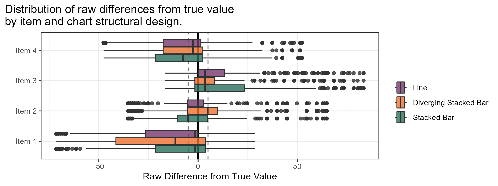

```{r setup, include=FALSE}
knitr::opts_chunk$set(
  echo = FALSE, 
  message = FALSE, 
  warning = FALSE
)
```


```{r packages}
library(haven)
library(survey)
library(ggplot2)
library(dplyr)
library(tidyr)
library(gt) ## remove if we don't use gt -- we'll figure this out later
library(gtsummary)
library(broom)
library(knitr) ## remove if we don't use knitr -- we'll figure this out later
library(kableExtra)
library(formattable)
library(stringr)
library(labelled)
## set default theme for ggplots so they all match
theme_set(theme_bw())

## set default gtsummary table theme so they all match
set_gtsummary_theme(theme_gtsummary_compact())

```


```{r citations, echo=FALSE, eval=FALSE}
# remotes::install_github("paleolimbot/rbbt")
# write bib file automatically
keys <- rbbt::bbt_detect_citations("ieee-special-issue-rmd.Rmd")

keys_not <- stringr::str_subset(keys, '(^fig-|^tbl-|^eq-|^sec-|^lst-|^thm-|^lem-|^cor-|^prp-|^cnj-|^def-|^exm-|^exr-)')

rbbt::bbt_write_bib(path='references.bib', keys=keys, ignore = keys_not, overwrite = TRUE, library_id=rbbt::bbt_library_id('Graphics-Research'), translator='biblatex')
```


<!-- 
shahBarLineGraph2011: 55 undergraduates
@carswellStimulusComplexityInformation1993: 32+15 undergrads
@zacksBarsLinesStudy1999: Sixty-nine Stanford University undergraduates + One hundred six Stanford University + -->

\chapteri{D}ata visualization displays data in visual elements and maps numbers to shape, position, color, size, etc to help illustrate relationships and patterns in the data. It is a valuable form of scientific communication as viewers use the resulting graphics to make real-life decisions based on data.


We know a lot about perception, or how people perceive data in charts. For example, there have been user studies on which shapes result in the most accurate relative size comparison [@clevelandGraphicalPerceptionTheory1984; @heerCrowdsourcingGraphicalPerception2010], the smallest visual difference detectable in a chart [@hughesJustNoticeableDifferences2001; @luModelingJustNoticeable2022], the impact of alignment of visual elements on viewer perception [@riceTestingPerceptualAccuracy2024], and how a change in scale impacts perception of pattern magnitude [@correllTruncatingYAxisThreat2020; @hofmanHowVisualizingInferential2020]. In concert, these user studies provide rich information about perception of value mappings in graphs. There have been several works which aggregate and summarize findings from perception studies on basic visual tasks and recommend evidence-based practices for the design of data graphics based on those findings [@carswellChoosingSpecifiersEvaluation1992;@franconeriScienceVisualData2021; @zengReviewCollationGraphical2023].

We know less, however, about how humans translate that perception into real-world conclusions. In particular, we want to know how well the design of a data visualization impacts user understanding and interpretation of data graphics.  Understanding the cognitive processes - beyond perception - that guide the user in making decisions or drawing conclusions about the data can better inform insights on design principles. 

Models have been previously proposed for estimating chart comprehension  [@pinkerTheoryGraphComprehension1990; @munznerNestedModelVisualization2009], with some specifically focused on bars and lines [@shahBarLineGraph2011; @zacksBarsLinesStudy1999]. Interpretation of line charts has previously been found to depend on complexity, with trend reversals adding to complexity more than the plotted number of data points for a very small data set [@carswellStimulusComplexityInformation1993]. However, many of the experiments underlying chart comprehension models were performed with small or biased sample sizes, with small groups of undergraduate students being a commonly studied population in this field (e.g., [@shahBarLineGraph2011; @zacksBarsLinesStudy1999; @carswellStimulusComplexityInformation1993]). 


Small sample sizes in many prior studies also mean we do not know as much about how understanding may differ across groups. While there is evidence to suggest that graph literacy - or the individual's abilty to accurately understand a graphic - varies by level of education and socieconomic status [@durandGraphLiteracyMatters2020; @garcia-retameroMeasuringGraphLiteracy2017], these studies focus primarily on univariate displays and simple graphics. Galesic and Garcia-Retamero developed and tested a scale for graph literacy among adult populations in the U.S. and Germany using probabilistic sampling [@galesicGraphLiteracyCrosscultural2011]. The Galesic and Garcia-Retamero study focused on simple data visualization forms and comprehension tasks and posited that basic graph comprehension relies on some level of formal education or exposure to charts. 

An improved understanding of viewer interpretation and how it differs across population groups will aid in the creation of data visualizations that communicate the intended information effectively. To this end, our study focuses on measuring to what extent U.S. adults understand the content in data graphics, whether the structure of the visualization impacts that understanding, and how this understanding differs across demographic groups. We fielded a survey-based user study with a nationally-representative, probability-based sample of U.S. adults. In this study, we vary the structure of charts presented and ask participants to answer questions about the content therein, focusing on their understanding of the data shown and the real-world conclusions drawn from the data. 

The remainder of this paper is structured as follows: first, we describe the study design, including details on our sample of participants and the design of experimental images and questions. Secondly, we summarise the resulting participant sample and discuss participant behavior during the experiment. Subsequently, we discuss participant responses to our study questions, including their response patterns, accuracy of their responses, and how accuracy differs across demographic groups and other participant characteristics. Finally, we summarise our analyses and findings and discuss the implications of this work for the data visualization researcher and practitioner communities. 


```{r load-data}
fulldata <- readRDS("../00_data/all-rounds.rds")
labels_metadata <- read.csv("../00_data/labels-metadata.csv")
```


```{r variable-creation}

## group some groups together 
fulldata <- fulldata |>
  mutate(Device = ifelse(Device == "Desktop", "Desktop", "Tablet, Smartphone, or Other"),
         RACETHNICITY = case_when(
            RACETHNICITY == 1 ~ "White, non-Hispanic",
            RACETHNICITY == 2 ~ "Black, non-Hispanic",
            RACETHNICITY %in% c(3,5,6) ~ "Other, non-Hispanic",
            RACETHNICITY == 4 ~ "Hispanic"
          ))


## pull in variables that are used in analyses here 
fulldata_prepped <- fulldata |>
  ## turn missings/don't knows into NA values for value estimation questions
  mutate(NOLA3A = ifelse(NOLA3A %in% c(777,998,999),NA,NOLA3A),
         NOLA3B = ifelse(NOLA3B %in% c(777,998,999),NA,NOLA3B),
         NOLA3C = ifelse(NOLA3C %in% c(777,998,999),NA,NOLA3C),
         NOLA3D = ifelse(NOLA3D %in% c(777,998,999),NA,NOLA3D)) |>
  ## turn all demographic variables into factors (replace numbers with underlying labels)
  mutate_at(c("GENDER", "AGE4", "RACETHNICITY", "EDUC5", "INCOME4", "Device", 
              "EMPLOY", "REGION4", "METRO", "INTERNET", "HOME_TYPE"), as_factor) |>
  ## calculate difference and absolute difference from correct value
  mutate(NOLA3A_abs_diff = abs(NOLA3A - 71.4),
         NOLA3B_abs_diff = abs(NOLA3B - 35.2),
         NOLA3C_abs_diff = abs(NOLA3C - 16.6),
         NOLA3D_abs_diff = abs(NOLA3D - 47.6),
         NOLA3A_diff = NOLA3A - 71.4,
         NOLA3B_diff = NOLA3B - 35.2,
         NOLA3C_diff = NOLA3C - 16.6,
         NOLA3D_diff = NOLA3D - 47.6) |>
  mutate(DESIGN = factor(DESIGN, levels = c("STACKED BAR", "DIVERGING STACKED BAR", "LINE"), labels = c("Stacked Bar", "Diverging Stacked Bar", "Line"))) |>
  rename(`Design` = DESIGN, `Gender` = `GENDER`, `Age` = AGE4, `Education` = EDUC5, `Income` = INCOME4, `Race/Ethnicity` = RACETHNICITY)


fulldata_prepped <- fulldata_prepped %>%
  ## calculate average distance from correct value across all 4 questions
  mutate(ave_abs_diff = 
           select(.,
                  c("NOLA3A_abs_diff","NOLA3B_abs_diff","NOLA3C_abs_diff","NOLA3D_abs_diff")
                  ) %>% rowMeans(na.rm = TRUE), 
         ave_diff = 
           select(.,
                  c("NOLA3A_diff","NOLA3B_diff","NOLA3C_diff","NOLA3D_diff")
                  ) %>% rowMeans(na.rm = TRUE)) |>
  ## calculate metrics for correctness
  mutate(abs_allcorrect = as.factor(ifelse(ave_abs_diff < 5,1,0)), ## if average absolute difference is <5
         allcorrect = as.factor(ifelse(abs(ave_diff) < 5,1,0)), ## if average difference is <5
         correct3A = ifelse(NOLA3A_abs_diff < 5,1,0),
         correct3B = ifelse(NOLA3B_abs_diff < 5,1,0),
         correct3C = ifelse(NOLA3C_abs_diff < 5,1,0),
         correct3D = ifelse(NOLA3D_abs_diff < 5,1,0), 
         numcorrectVE = correct3A + correct3B + correct3C + correct3D) |>
  ## to give us a single record for each case
  mutate(maintain = 1) |>
  ## things to add: 
  ## metrics on straight-lining the answers
  mutate(check = ifelse(NOLA3A==NOLA3B & NOLA3B==NOLA3C & NOLA3C==NOLA3D,1,0), 
         behavior = case_when(
                      NOLA2_1 %in% c(1) & NOLA2_2 %in% c(1) & NOLA2_3 %in% c(1) & 
                          NOLA2_4 %in% c(1) & NOLA2_5 %in% c(1) ~ "all true",
                      NOLA2_1 %in% c(0) & NOLA2_2 %in% c(0) & NOLA2_3 %in% c(0) & 
                          NOLA2_4 %in% c(0) & NOLA2_5 %in% c(0) ~ "all false",
                      TRUE ~ "mixed"
  )) |>
  ## timing thresholds
  mutate(
    speederISitems = case_when(
    NOLA2_TOTALTIME >= 25 ~ "non-speeder",
    NOLA2_TOTALTIME < 25 ~ "speeder"
  ),
  speederISitems2 = case_when(
    speederISitems == "non-speeder" ~ 1,
    speederISitems == "speeder" ~ 0
  ), 
  speederVEitems = case_when(
    NOLA3_TOTALTIME >= 20 ~ "non-speeder", 
    NOLA3_TOTALTIME < 20 ~ "speeder",
    is.na(NOLA3_TOTALTIME) ~ "speeder"
  ), 
  speederVEitems2 = case_when(
    speederVEitems == "non-speeder" ~ 1, 
    speederVEitems == "speeder" ~ 0, 
    is.na(speederVEitems) ~ 0,
  )) |>
  ## create correctness measure for TF1 through TF5
  mutate(TF1 = case_when(NOLA2_1%in%c(1) ~ 1,
                         TRUE ~ 0),
         TF2 = case_when(NOLA2_2%in%c(1) ~ 1,
                         TRUE ~ 0),
         TF3 = case_when(NOLA2_3%in%c(0) ~ 1,
                         TRUE ~ 0),
         TF4 = case_when(NOLA2_4%in%c(1) ~ 1,
                         TRUE ~ 0),
         TF5 = case_when(NOLA2_5%in%c(0) ~ 1,
                         TRUE ~ 0)) 

## calculate number of T/F correct 
fulldata_prepped$numcorrectIS <- rowSums(fulldata_prepped[,c("TF1", "TF2", "TF3", "TF4", "TF5")])

fulldata_prepped$Education <- remove_var_label(fulldata_prepped$Education)
fulldata_prepped$Income <- remove_var_label(fulldata_prepped$Income)

```

```{r survey-design}
## define survey design for calculating survey estimates and completing modeling tasks while incorporating survey weights 
fulldata_design <- svydesign(ids=~1, data = fulldata_prepped, weights = ~WEIGHT_SCALED)


## function to calculate effective sample size
neff <- function(weight) {
  n <- length(weight)
  L <- var(weight)/mean(weight)^2
  n/(1+L)
}

```


# Study Design {#design}


We leveraged a survey format to conduct our user study, presenting survey participants with chart images and asking them to answer survey items about the content of the charts. The study has two major design components: the survey sampling and weighting strategy, and the design of the stimuli and corresponding survey questions. 


## Sample Design  

We utilized NORC's AmeriSpeak Omnibus panel, a biweekly survey that samples from a standing panel of over 54,000 members aged 13 and over [@dennis2019technical] and results in around 1,000 respondents in each round. The panel samples U.S. households using NORC's National Sample Frame, which provides coverage of over 97% of U.S. households. Due to the visual nature of our study, we excluded panelists responding through phone interviews, including only web-based panelists. Web-based respondents make up 93.3% of the total panel and 96.3% of the total panel weights.  

Sampling was conducted across 48 sampling strata -- split by age, education, gender, and race and Hispanic ethnicity. Each sampling stratum's size was determined by the corresponding population distribution, and takes expected differential survey completion rates into account in order to achieve a representative sample of the target population -- here, U.S. adults. Resulting survey data were weighted to the U.S. Census Bureau's Current Population Survey (CPS) benchmarks and balanced by gender, age, education, race/ethnicity, and geographic region. Participants complete a consent statement as part of their participation in the panel. 


## Experimental Design  

Using data on the distribution of living arrangements among older age-sex groups in the United States, we created three different visual stimuli - a stacked bar chart, a diverging stacked bar chart, and a line chart, pictured in Figure 1. The data presented, size of the chart, color scheme, and legend were identical across all three chart types, with the only difference being the structural design of the chart. Keeping the survey items and context identical across rounds allows us to assume that differences in responses are due to the structure and type of the chart. The displayed data -- survey results on living arrangements of older age-sex groups -- was selected to be a minimally controversial topic. At the same time, the topic was also intentionally chosen to be straightforward and relevant to participants' lives. The stimulus presented here is of medium complexity, as complexity is assessed by [@shahBarLineGraph2011].


\begin{figure*}
\includegraphics[width=36pc]{images/visual-stimuli-combined.png}
\label{stimulus-images}
\caption{The visual stimuli shown to participants in the experiment. Participants saw either a stacked bar (left), line chart (center), or diverging stacked bar (right) representation of the same data in each round.}
\end{figure*}

In each round of the Omnibus, participants were shown one of the stimuli and questioned about the chart and data presented. First, participants were asked to determine which of five statements in the survey were supported by the data in the chart. We presented three statements that were supported by the chart (i.e., were true) and two statements that were not supported by the chart (i.e., were false).  The default selection for participants was no selection of the item, which corresponds to an indication of false for each statement. Participants had to select the true statements. We refer to these items as "interpretation statement" items. 


*Which of the following statements is supported by the chart?*

\begin{enumerate}
\item{More than half of all 70-79 year old men live in households with others (TRUE).}
\item{In each age-sex category, more adults live in households than in nursing homes or other group quarters (TRUE).}
\item{Compared to men, a higher percentage of women in each age group live in households with others (FALSE).}
\item{The percentage of adults living in nursing homes or other group quarters increases with age (TRUE).}
\item{The percentage of men who live alone in a household decreases with age (FALSE).}
\end{enumerate}


The statements presented to participants vary in difficulty, reflecting the complexity of the tasks required to answer them correctly. For example, the first item is relatively simple, requiring a participant to identify a single visual element (percentage of 70-79 year old men living in households with others) and determine whether it is larger than 50\%. This task involves relatively few visual elements and participants may not have to complete any comparisons to other elements to determine it is a true statement. Other items are more difficult: in item 2, participants have to identify which visual elements correspond to living in households (blue bars or lines/points), which correspond to living in nursing homes or other group quarters (orange bars or lines/points), and then compare those visual elements across each age-sex group. Determining whether the second item is supported by the chart requires a much more involved set of steps and comparisons than item 1. In the presentation of results, we sort items by their difficulty based on the number of visual elements required to assess each provided statement.  


Following the completion of interpretation statement items, participants were given four items that required them to identify and estimate specific data values within the chart by providing an integer value between 0 and 100. 


*What is the approximate size of the following? Just your best guess is fine.*

 \begin{enumerate}
  \item{Among 80-89 year old men, what is the percentage living with others in households?}
  \item{Among 100+ year old women, what is the percentage living in a nursing home?}
  \item{Among 70-79 year old men, what is the percentage living alone in a household?}
  \item{Among 90-99 year old women, what is the percentage living alone in a household?}
  \end{enumerate}


For each of these items, participants must identify the correct visual element within the chart (e.g., the element representing the percentage of 80-89 year old men living with others in households) and subsequently estimate the corresponding value using either the size (stacked bar and diverging stacked bar) or position (line chart) of that visual element. While estimating these values is primarily a perception task, it also requires identifying the correct chart element with provided context. This tests users' ability to understand legends and labels and apply that information to the real-world data in the chart. Each of these items are assumed to carry a similar level of difficulty as the required steps are identical with the exception of the final step, estimating the value itself. These items should also carry a similar difficulty to the first interpretation statement item. We will henceforth refer to this set of items as the "value estimation" items.  


In designing the study items, we hypothesized that the interpretation statements carry a higher degree of difficulty than the value estimation questions. A basic understanding of the context within the chart is required to identify the corresponding elements in both sets of items; however, the interpretation statements require further inspection of the relationships between the represented values. 

Participants were first shown all five interpretation statement items on a single screen with the accompanying chart. After completing those, participants were shown all four value estimation questions on a screen, again with the corresponding chart image. Participants could not go backwards to the interpretation statements to change their response. On each screen, participants could choose to zoom in to a larger version of the chart. 

# Participants {#participants} 


A total of 3,176 panelists participated across the three rounds. The resulting data from each of the three rounds were combined into a shared response file. Their corresponding sample weights were rescaled with respect to the total response population across all three rounds in order to preserve their respective weights following the combination method described by O'Muircheartaigh and Pedlow [@omuircheartaighCombiningSamplesVs2002]. Indicators for round of origin were appended in the combined file. The number of responses and corresponding effective sample sizes and weights for each round of the study are shown in Table 1. 


\begin{table*}
\label{participantstable}
\caption{Rounds of study: Number of respondents (sample size), effective sample size, sum of weights and estimated lambda value factors used for combining surveys weights across the three rounds of the study.}
```{r participants-table}
fulldata_prepped |>
  group_by(Design) |>
  summarise(n = n(), 
            eff_samp_size = round(neff(WEIGHT_SCALED), 1), 
            sum_weights = round(sum(WEIGHT_SCALED), 1)) |> ungroup()|>
  mutate(lambda =round(eff_samp_size/sum(eff_samp_size), 3)) |>
  setNames(c("Design", "# Respondents", 
             "Effective Sample Size", "Sum of Weights", "Lambda values")) |> 
  ungroup() |>
  kbl(booktabs = T)
```
\end{table*}

The distributions of self-reported demographic characteristics of participants across the rounds are shown in Table 2. The percentages are calculated marginally using survey weights. The distribution of demographic characteristics are substantively similar across the three rounds of this study. The "Asian-Pacific Islander, non-Hispanic", "2+, non-Hispanic", and "Other, non-Hispanic" race/ethnicity groups were grouped into a shared "All others, non-Hispanic" for our analyses due to small sample sizes in the distinct groups. 

\begin{table*}
\label{demographicstable}
\caption{Self-reported participant demographic characteristics. Percent of weighted sample in each demographic group shown. Demographic representation by Age, Education, Gender, Income, and Race/Ethnicity is similar across the three distinct stimuli shown to participants. Values within a given chart type and demographic may not sum to 100 due to rounding.}
```{r demographics-table}
demotab <- svyby(~Gender+Education+Age+Income+`Race/Ethnicity`, 
      by = ~ROUND, fulldata_design, svymean) |> data.frame(optional = TRUE) |>
  select(-c(ROUND, GenderUnknown, AgeUnder.18, optional)) |> 
  select(-contains("se.")) |> 
  t() |> 
  as.data.frame() |> 
  tibble::rownames_to_column(var = "old_name") |>
  left_join(labels_metadata) |>
  mutate(
    `ROUND 10` = round(`ROUND 10`*100, 1),
    `ROUND 14` = round(`ROUND 14`*100, 1), 
    `ROUND 15` = round(`ROUND 15`*100, 1)
  )|>
  arrange(category, order) |>
  select(`Demographic` = category, `Group` = group, `Stacked Bar` = "ROUND 10", `Diverging Stacked Bar` = "ROUND 15", `Line Chart` = "ROUND 14") 

demotab |>
    kbl(booktabs = T) |>
  collapse_rows(1, valign = "top")#optional = TRUE) |> 
```
\end{table*}


## Participant Behavior 

Metadata on participant behavior was captured, including device used to complete the survey and time spent on each set of questions, and the use of zooming. We determined that participants who completed the interpretation statement items in less than 25 seconds or the value estimation items in less than 20 seconds -- an assumption of spending less than or equal to 5 seconds per item in the set -- were speeding through the questions. We assume it would be very difficult to read an item, determine an answer, and provide that answer within five seconds or less [@brysbaertHowManyWords2019a]. It is possible that some of these identified speeders meaningfully completed several sub-items before dropping off due to fatigue or frustration. We did not remove these participants outright but rather appended an identifier for speeding behavior and incorporated it as a predictor in all modeling, so we could better understand how speeders' accuracy differs on our sets of items. 


\begin{figure}

```{r}
genspeed <- svyby(~speederISitems2+speederVEitems2, 
      by = ~Gender, fulldata_design, svymean) |>
  as.data.frame() |>
  setNames(c("Demo Group", "Interpretation", "Value Est", "Interpretation SE", "Value Est SE")) |>
  mutate(Demo = "Gender")


educspeed <- svyby(~speederISitems2+speederVEitems2, 
      by = ~Education, fulldata_design, svymean) |>
  as.data.frame() |>
  setNames(c("Demo Group", "Interpretation", "Value Est", "Interpretation SE", "Value Est SE")) |>
  mutate(Demo = "Education")

incspeed <- svyby(~speederISitems2+speederVEitems2, 
      by = ~Income, fulldata_design, svymean) |>
  as.data.frame() |>
  setNames(c("Demo Group", "Interpretation", "Value Est", "Interpretation SE", "Value Est SE")) |>
  mutate(Demo = "Income")
  
  
agespeed <- svyby(~speederISitems2+speederVEitems2, 
      by = ~Age, fulldata_design, svymean) |>
  as.data.frame() |>
  setNames(c("Demo Group", "Interpretation", "Value Est", "Interpretation SE", "Value Est SE")) |>
  mutate(Demo = "Age")
  
  
racespeed <- svyby(~speederISitems2+speederVEitems2, 
      by = ~`Race/Ethnicity`, fulldata_design, svymean) |>
  as.data.frame() |>
  setNames(c("Demo Group", "Interpretation", "Value Est", "Interpretation SE", "Value Est SE")) |>
  mutate(Demo = "Race/Ethnicity")

speed_tab <- rbind(genspeed, educspeed,incspeed,agespeed,racespeed) |>
  pivot_longer(cols = Interpretation:`Value Est SE`, names_to = "valuetype", values_to = "value") |>
  mutate(is_se = ifelse(str_detect(valuetype, " SE") == T, "SE", "Value"), 
         valuetype = str_replace(valuetype, " SE", "")) |>
  pivot_wider(names_from = is_se)
speed_p <- speed_tab |>
  mutate(
    Demo=gsub("/", "/\n", Demo),
    `Demo Group`=gsub("/", "/\n", `Demo Group`),
    `Demo Group`=gsub("equivalent", "equiv", `Demo Group`),
    `Demo Group`=gsub(",000", "k", `Demo Group`)
  ) |>
  ggplot() + 
  geom_point(aes(x = (1-Value), y = `Demo Group`, color = valuetype), size = 3) +
  geom_linerange(aes(xmin = (1 - Value) - SE, xmax = (1-Value) + SE, y = `Demo Group`, color = valuetype), linewidth = 1.3) + 
  xlim(c(0, NA)) + 
  facet_grid(Demo~., space = "free_y", scales = "free_y") + 
  theme(legend.position = "top", 
        plot.title.position = "plot", 
        strip.text.y = element_text(angle = 0), 
        axis.text = element_text(size = 10), 
        plot.title = element_text(size = 18), 
        legend.text = element_text(size = 13), 
        strip.text = element_text(size = 13)) +
  scale_colour_manual(values = c("#ca500a", "#4C7B91"), name = "") +
  guides(colour = guide_legend(reverse = T)) + 
  labs(x = "Proportion of respondents speeding\n(+/- 1 s.e.)", y = "", 
       title = "Rates of speeding behavior across\ndemographic groups and item type")

ggsave(plot = speed_p, filename = "images/speeding.png", dpi = 300, height = 9, width = 5)

```
\includegraphics[width=18pc]{images/speeding.png}
\caption{Speeding behavior by participants. Participants were flagged as speeding on each set of items if they spent less than 5 seconds per item, on average, within a set (25 and 20 seconds for interpretation statement and value estimation items, respectively). Participants were more likely to speed through the interpretation statement items.}
\end{figure}

Notably, speeding behavior was more prevalent on the interpretation statement items (n = 686) as compared to the value estimation items (n = 141). This is interesting on multiple fronts: for one, since the interpretation statement items were presented first; if speeding behavior was due to survey fatigue alone, we would expect to see similar or higher rates of speeding in the latter set of questions. We observed the reverse, with participants more likely to speed through the first set of questions. We also assumed the interpretation statements should take more time per item, as they require more visual elements to address the validity of the statement; however, we see more respondents completing these items quickly. This could be attributed to frustration with the increased difficulty of the interpretation statement items or a lack of understanding of how to answer the questions. This is supported by the demographic patterns we observe among speeders; those with lower levels of educational attainment and lower income levels had higher rates of speeding behavior (see Figure 2). 

One additional contributing factor to the differential speeding rates could be that the interpretation statements were presented in a 'select all that apply' format which requires clicking on the relevant corresponding items within the set, whereas the value estimation items require an input value separately for each item. Setting aside the content of the items, the minimal time required to complete the value estimation items should be higher. Nevertheless, our assumptions on the time to read the statements, assess them, and reach a conclusion still hold; we simply acknowledge that it is physically easier to speed through the interpretation statements than the value estimation items if a participant is already going quickly. 


# Results 

We present results on the response patterns and accuracy of participant responses for the interpretation statement and value estimation items. Subsequently, we discuss the relationship between responses across the two sets of items and the implications of that relationship.


## Interpretation Statements

Each of the interpretation questions requires participants to complete a distinct task and utilize different sets of information in the chart. We first investigate the overall accuracy of our participants on each item by chart design, shown in Figure 3. We define correctness as a binary variable indicating whether the participant correctly selected the corresponding item (in the case of True statements) or did not select the corresponding item (in the case of False statements). 


\begin{figure}

```{r}
accbyitem_p <- svyby(~TF1+TF2+TF3+TF4+TF5, 
      by = ~Design, fulldata_design, svymean) |>
  as.data.frame() |>
  pivot_longer(cols = TF1:`se.TF5`, names_to = "valuetype", values_to = "value") |>
  mutate(is_se = ifelse(str_detect(valuetype, "se.") == T, "SE", "Value"), 
         valuetype = str_replace(valuetype, "se.", "")) |>
  pivot_wider(names_from = is_se) |>
    mutate(valuetype = factor(valuetype, levels = c("TF1", "TF5", "TF3", "TF4", "TF2"), labels = c("Item 1", "Item 5", "Item 3", "Item 4", "Item 2"))) |>
  ggplot() + 
  geom_point(aes(x = Value, y = valuetype, color = Design), size = 4,
             position = position_dodge(width = 0.5)) +
  geom_linerange(aes(xmin = Value - SE, xmax = Value + SE, y = valuetype, color = Design), 
                 position = position_dodge(width = 0.5), linewidth = 1.3) + 
  theme(legend.position = "top", 
        plot.title.position = "plot", 
        legend.location = "plot", 
        legend.justification = 0, 
        axis.text = element_text(size = 10)) +
  labs(x = "Proportion of correct responses\n(+/- 1 s.e.)", y = "",
       title = "Accuracy on interpretation statement items\nby item and chart type") + 
  scale_colour_manual(values = c("#286F5D", "#EC712E", "#76376B"), name = "") + 
  guides(colour=guide_legend(ncol=3,nrow=1,byrow=TRUE, reverse = T))

ggsave(plot = accbyitem_p, filename = "images/accbyitem.png", height = 6, width = 4, dpi = 300)
```

\includegraphics[width=18pc]{images/accbyitem.png}
\caption{Percentage of respondents who selected the correct answer on each of the 5 interpretation statement items by chart structure. Items are ordered from most difficult (top, Item 2) to least difficult (bottom, Item 1) based on how many visual elements within the chart are required to assess the validity of the statement. Weighted survey mean and standard error bars are shown.}
\end{figure}


Items 5 and 3 have the highest levels of accuracy across all three chart structures. Notably, there are no clear patterns for any given chart design having the highest or lowest accuracy across all five items; the stacked bar excels for Item 1, put performs similarly to the diverging stacked bar in Items 4 and 2, and slightly lower in Item 5. The Line format appears to have lower performance for the most difficult items -- Items 2 and 4, but does well in Items 3 and 5. 

While we assume Item 1 is the least difficult item due to the fact that only one visual element is required to assess it, we also note that false statements (Items 3 and 5) are by nature easier than true statements when multiple visual elements are involved. True statements involving multiple visual elements must hold true across all those visual elements, while a false statement only has to be disproven by a single example or visual element to be determined to be false. We also note that True/False items should have a baseline 50% accuracy rate by nature if participants guess without considering the content.

### Accuracy of responses  


We fit a logistic regression to model the proportion of correct responses out of 5 items, under chart type $j$ for respondent $k$: 

\begin{equation}
\mbox{logit}\ P(Y_{jk}) = \alpha_j + X_k\beta
\end{equation}

where $j = \{1, 2, 3\}$ indicate chart type of the visual stimuli shown to participants, with $1 = \mbox{Stacked Bar},\ 2 = \mbox{Diverging Stacked Bar},\ 3 = \mbox{Line}$, and assume participants $k=1, \dots, n$. Note that $X_k$ represents the matrix of demographic characteristics of participant $k$, including 4-category Race/Ethnicity, 4-category age group, 4-category income group, 5-category education level, and 2-category gender. 

The resulting model estimates are displayed in Table 3. 


\begin{table*}
\caption{Model summary table for logistic model for proportion of correct responses to interpretation statement items. Log odds ratio (OR), 95\% confidence interval (CI) for each estimate, and corresponding p-value are presented for each model predictor. The level of each variable represented in the model intercept is denoted by a blank row, where relevant. }
```{r tfmodeltable, results='asis'}
model <- svyglm(cbind(numcorrectIS,5)~Design + speederISitems + Device + Education + Income + Age + Gender + `Race/Ethnicity`, 
                fulldata_design, family = quasibinomial())
#set_gtsummary_theme(theme_gtsummary_compact())
tbl_regression(model, pvalue_fun = function(x) style_pvalue(x, digits = 3)) |> 
  modify_table_styling(text_interpret = "md") |>
  bold_p() |> 
  bold_labels() |>
  italicize_levels() |>
  as_kable(booktabs = T, format = "latex", escape = F) |>
  as.vector() |>
  str_replace_all(  pattern = "\\*\\*(.*?)\\*\\*", replacement = "\\\\textbf{\\1}") |>
  str_replace_all(pattern = "\\_\\_(.+?)\\_\\_", "\\\\textbf{\\1}") |>
  str_replace_all(pattern = "\\%", replacement = "\\\\%") |>
  str_replace_all(pattern = "\\_(.*?)\\_", replacement = "\\\\textit{\\1}") |>
    str_replace_all(pattern = "\\$", replacement = "\\\\$") |>
  str_replace_all(pattern = "\\n\\\\addlinespace\\n", replacement = "") |>
  cat()
```
\end{table*}


The stacked bar and diverging stacked bar charts resulted in the highest proportion of correct responses, on average, with the line chart corresponding to a minor, but significant, decrease in proportion of correct responses. Speeding behavior had a major impact on accuracy, unsurprisingly, with those who did not speed seeing significantly higher rates of accuracy than those who did speed. Those using a tablet, smartphone, or other non-desktop device to complete the web-based survey experienced a decrease in accuracy as well.  

After accounting for differences across designs, speeding behavior, and device used, the proportion of correct responses increased significantly with higher levels of educational attainment. Gender and age were not significant predictors of accuracy after accounting for education, but older age groups had lower accuracy levels. 


\begin{figure*}


```{r is-item-models, fig.cap = "Model coefficient plot for logistic regression models predicting accuracy on each of the five interpretation statement items. "}
model_IS1 <- svyglm(TF1~Design + speederISitems + Device + Education + Income + Age + Gender + `Race/Ethnicity`,
                fulldata_design, family = quasibinomial())
model_IS1_tab <- tbl_regression(model_IS1) |>
  modify_column_hide(ci) |>
  bold_p()

model_IS2 <- svyglm(TF2~Design + speederISitems + Device + Education + Income + Age + Gender + `Race/Ethnicity`,
                fulldata_design, family = quasibinomial())
model_IS2_tab <- tbl_regression(model_IS2) |>
  modify_column_hide(ci) |>
  bold_p()

model_IS3 <- svyglm((TF3)~Design + speederISitems + Device + Education + Income + Age + Gender + `Race/Ethnicity`,
                fulldata_design, family = quasibinomial())
model_IS3_tab <- tbl_regression(model_IS3) |>
  modify_column_hide(ci) |>
  bold_p()

model_IS4 <- svyglm(TF4~Design + speederISitems + Device + Education + Income + Age + Gender + `Race/Ethnicity`,
                fulldata_design, family = quasibinomial())
model_IS4_tab <- tbl_regression(model_IS4) |>
  modify_column_hide(ci) |>
  bold_p()

model_IS5 <- svyglm((TF5)~Design + speederISitems + Device + Education + Income + Age + Gender + `Race/Ethnicity`,
                fulldata_design, family = quasibinomial())
model_IS5_tab <- tbl_regression(model_IS5) |>
  modify_column_hide(ci) |>
  bold_p()

model_IS1_coefs <- as.data.frame(coef(summary(model_IS1))) |>
  mutate(item = "Item 1")|>
  setNames(c("estimate", "se", "t", "p", "item")) |>
  tibble::rownames_to_column(var = "variable")
model_IS2_coefs <- as.data.frame(coef(summary(model_IS2))) |>
  mutate(item = "Item 2")|>
  setNames(c("estimate", "se", "t", "p", "item")) |>
  tibble::rownames_to_column(var = "variable")
model_IS3_coefs <- as.data.frame(coef(summary(model_IS3))) |>
  mutate(item = "Item 3") |>
  setNames(c("estimate", "se", "t", "p", "item")) |>
  tibble::rownames_to_column(var = "variable")
model_IS4_coefs <- as.data.frame(coef(summary(model_IS4))) |>
  mutate(item = "Item 4")|>
  setNames(c("estimate", "se", "t", "p", "item")) |>
  tibble::rownames_to_column(var = "variable")
model_IS5_coefs <- as.data.frame(coef(summary(model_IS5))) |>
  mutate(item = "Item 5")|>
  setNames(c("estimate", "se", "t", "p", "item")) |>
  tibble::rownames_to_column(var = "variable")

varlabels_key <- fulldata_prepped |> 
  select(speederISitems, Design, Device, Education, Income, Age, Gender, `Race/Ethnicity`) |>
  pivot_longer(cols =speederISitems:`Race/Ethnicity`, names_to = "demographic", values_to = "category") |> 
  arrange(demographic) |> 
  distinct() |> 
  mutate(variable = ifelse(demographic == "Race/Ethnicity", paste0("`Race/Ethnicity`", category), paste0(demographic, category)))


itemaccuracy_p_dat <- bind_rows(model_IS1_coefs,
          model_IS2_coefs,
          model_IS3_coefs,
          model_IS4_coefs,
          model_IS5_coefs) |>
  mutate(estimate = round(estimate, 2),
         is_sig = ifelse(p <= 0.05, T, F),
         item = factor(item, levels = c("Item 1", "Item 5", "Item 3", "Item 4", "Item 2")
                       )
         ) |>
  left_join(varlabels_key) |>
  mutate(category = ifelse(is.na(category), "(Intercept)", category), 
         demographic = ifelse(is.na(demographic), "(Intercept)", demographic)) |>
  mutate(demographic = factor(demographic, levels = c("(Intercept)", "Design", "speederISitems", "Device", "Education", "Income", "Age", "Gender", "Race/Ethnicity"))) 

itemaccuracy_p <- itemaccuracy_p_dat |>
    ggplot() +
  # separate color from tile - makes legend easier to control
  geom_tile(aes(x = item, y = category, fill = estimate), width = 0.7, height = 0.7) +
  geom_tile(aes(x = item, y = category, colour = is_sig), fill = NA, width = 0.7, height = 0.7, linewidth = .7, data = itemaccuracy_p_dat %>% filter(is_sig)) +
  scale_fill_gradient2(low = "#ec712e", high = "#4C7B91", mid = "white", midpoint = 0, name = "Coefficient") +
  scale_color_manual(label = "Significant\n (at p < 0.05)", values = c( "grey20"), name = "") +
  geom_text(aes(x = item, y = category, label = estimate)) +
  theme_bw() + 
  theme(strip.text.y = element_text(angle = 0), 
        legend.position = "top", 
        legend.title.position = "top") + 
  facet_grid(demographic~., scales = "free_y", space = "free_y") + 
  labs(x = "", y = "") 

ggsave(plot = itemaccuracy_p, filename = "images/itemaccuracy.png", dpi = 300, height = 8, width = 7)

```

\includegraphics[width=36pc]{images/itemaccuracy.png}
\caption{Model coefficient plot for logistic regression models predicting accuracy on each of the five interpretation statement items. The value shown in each square denotes the fitted model coefficient for that predictor. The backgound color denotes the size of the estimate, with darker blue values indicating a higher positive coefficient and darker orange indicating a larger negative coefficient. The grey border indicates significance of the model coefficient. Items are ordered by assumed level of difficulty, with Item 1 being the simplest and Item 2 being the most difficult.}

\end{figure*}

We also investigate item-specific logistic regression models to understand differences across different types of interpretation statement items. We utilize a logistic regression for correctness on item $i$ under chart type $j$ for respondent $k$ and model:

\begin{equation}
\mbox{logit}\ P(Y_{ijk} = 1) = \mu_i + \alpha_j + X_k\mathbf{\beta}
\end{equation}

We fit a distinct model for each item $i$, simplifying the form to:

\begin{equation}
\mbox{logit}\ P(Y_{1jk} = 1) = \mu_1 + \alpha_j + X_k\beta
\end{equation}

for Item 1, for example. The corresponding model coefficients for each of the 5 models are shown in  Figure 4. 

We observe that those who did not speed did significantly better on Items 1, 4, and 2; a similar pattern is observed for higher levels of educational attainment. Of note is that Items 1, 4, and 2 were the true items, requiring a respondent to explicitly select 'true' to get the item correct. This likely contributes to the significant increase in accuracy among non-speeders. The line chart design was associated with lower levels of accuracy on items 1, 4, and 2 while the diverging stacked bar was a mixed bag -- resulting in increased accuracy on Item 5, but decreased accuracy for Items 1 and 3. Use of a tablet, smartphone, or other non-desktop device decreased accuracy on some items, but this was not universally true. 


## Value Estimation  

We assume each value estimation question presents the same baseline difficulty to participants, as the task is structured similarly for all: participants must identify the relevant age group, sex group and living situation and subsequently estimate the value of the corresponding visual element shown in the chart. 


### Response patterns  

We first investigate the response patterns across each of the four value estimation items. The distribution of the raw difference from participants' answers to the true value is shown in Figure 5. While the median differences are similar across each chart design for most items, we note that the line chart median difference is closest to zero when summed across the four items. Additionally, on Item 2 the diverging stacked bar led to a positive median difference, while the stacked bar led to a slightly negative median difference. We observe the smallest IQRs under the line chart for Items 1, 2, and 3. Item 4 resulted in IQRs of similar magnitude across all three chart types. The diverging stacked bar design also led to a very large IQR for the raw difference from the true value on Item 1, which had a true value of 71.4. 

\begin{figure*}

```{r vepatternsc}
vepatterns_p <- fulldata_prepped %>%
  mutate(CaseId = 1:nrow(fulldata_prepped)) %>%
  select(CaseId, speederISitems2, NOLA3A_diff, NOLA3B_diff, NOLA3C_diff, NOLA3D_diff, WEIGHT_SCALED, ROUND, Design) %>%
  pivot_longer(cols = NOLA3A_diff:NOLA3D_diff, names_to = "question", values_to = "value") %>%
  ## Remove missing/NA values or out-of-range values
  filter(value <=100) %>%
  mutate(question = factor(question,
                           levels = c("NOLA3A_diff", "NOLA3B_diff", "NOLA3C_diff", "NOLA3D_diff"),
                           labels = c("Item 1", "Item 2", "Item 3", "Item 4")),
         Design = factor(Design, levels = c("Stacked Bar",
                                            "Diverging Stacked Bar",
                                            "Line"))) %>%
  ggplot() +
  geom_vline(xintercept = 0, lwd = 1.2) + 
  geom_vline(xintercept = c(-5, 5), linetype = 2, color = "grey50") + 
  geom_boxplot(aes(x = value, y = question, fill = Design), alpha = 0.8) + 
  labs(x = "Raw Difference from True Value", 
       y = "", 
       title = "Distribution of raw differences from true value\nby item and chart structural design.") + 
  theme(plot.title.position = "plot") + 
  scale_fill_manual(values = c("#286F5D", "#EC712E", "#76376B"), name = "") + 
  guides(fill=guide_legend(reverse = T))

ggsave(filename = "images/vepatterns.png", plot = vepatterns_p, dpi = 300, height = 3, width = 8)
#

```

\includegraphics[width=36pc]{images/vepatterns.png}
\label{vepatterns}
\caption{Distribution of participants' raw difference from the true value for each of the value estimation items shown in a boxplot. Vertical dashed grey lines are placed at -5 and 5. The line chart resulted in the minimal raw difference across the four items, although for each item one of the other designs performed at least as well as the line chart. Note that the range of raw differences shifts as it is the calculation of the value the respondent provided (a number 0 to 100) and the true value.}
\end{figure*}


### Accuracy of responses  

To assess overall accuracy of participants' responses to the item set, we define correctness as a binary variable indicating whether the participants' response was within 5 points of the true value presented in the chart.

Similar to our model for accuracy on interpretation statement items, we fit a logistic regression to model the proportion of correct responses out of 4 items. We assume the same model format as Equations (2) and (3) and utilize the same set of participant behavior and demographic characteristics. The resulting model estimates are displayed in Table 4. 


\begin{table*}
\label{vemodeltable}
\caption{Model summary table for logistic model for proportion of correct responses to value estimation items, where a correct response is a value within 5 of the true value. Log odds ratio (OR), 95\% confidence interval (CI) for each estimate, and corresponding p-value are presented for each model predictor. The level of each variable represented in the model intercept is denoted by a blank row, where relevant.}
```{r, results = 'asis'}
modelve <- svyglm(cbind(numcorrectVE,4)~Design + speederVEitems + Device + Education + Income + Age + Gender + `Race/Ethnicity`, 
                fulldata_design, family = quasibinomial())
#set_gtsummary_theme(theme_gtsummary_compact())
tbl_regression(modelve, pvalue_fun = function(x) style_pvalue(x, digits = 3)) |> 
  bold_p() |> 
  bold_labels() |>
  italicize_levels() |>
  as_kable(booktabs = T, format = "latex", escape = F) |>
  as.vector() |>
  str_replace_all(  pattern = "\\*\\*(.*?)\\*\\*", replacement = "\\\\textbf{\\1}") |>
  str_replace_all(pattern = "\\_\\_(.+?)\\_\\_", "\\\\textbf{\\1}") |>
  str_replace_all(pattern = "\\%", replacement = "\\\\%") |>
  str_replace_all(pattern = "\\_(.*?)\\_", replacement = "\\\\textit{\\1}") |>
    str_replace_all(pattern = "\\$", replacement = "\\\\$") |>
    str_replace_all(pattern = "\\n\\\\addlinespace\\n", replacement = "") |>
  cat()
```

\end{table*}

The line chart format resulted in the highest total rates of accuracy across the four value estimation items; while this is inconsistent with the interpretation statement results it is not particularly surprising since the line chart format is also the only format with a reference grid and percent labels along the relevant axis. Those who did not speed through the value estimation items had significantly higher levels of accuracy, while those who completed the survey on a tablet, smartphone, or other non-desktop device had significantly lower levels of accuracy. 

Demographics play a major role in respondent accuracy; higher levels of educational attainment and income were associated with a higher number of correct responses, while increasing age was associated with lower numbers of correct responses. The Black non-Hispanic and Hispanic groups had significantly lower rates of accuracy than the Other non-Hispanic and White non-Hispanic groups. As in the interpretation statement model, gender was not a significant predictor of accuracy. 

In contrast to the interpretation statement results, higher levels of income were associated with higher rates of accuracy on the value estimation items even after accounting for education. 

## Relationship between Item Sets  

Finally, we investigate the relationship between participant accuracy on the two item sets: interpretation statements and value estimation. In Table 5 we display model coefficients for a logistic regression for the number of interpretation statements correctly answered. After accounting for speeding behavior, we find that each additional value estimation item correctly answered is associated with a significant increase in the proportion of interpretation statement items answered correctly. Greater ability to interpret the context within a chart, identify the correct element, and estimate its value, also indicates a stronger ability to accurately assess a set of real-world conclusion statements about the content shown in the chart. 

On the contrary, in Table 6, we see that the same cannot be said for the ability to answer the interpretation statement items. After accounting for speeding behavior, a higher number of interpretation statement items correct -- in particular, 3 or more correct out of 5 -- does not significantly increase ability to answer the value estimation questions.  


\begin{table}

\caption{Regression table for the number of interpretation statement items correctly answered by speeding behavior and number of value estimation items correctly answered. A higher number of value estimation items answered correctly is associated with an increased number of interpretation statement items correctly answered, after accounting for speeding behavior. }

```{r, results='asis'}
comparemodel1 <- svyglm(cbind(numcorrectIS, 5) ~ speederISitems + factor(numcorrectVE), 
       fulldata_design, family = quasibinomial()) 
#set_gtsummary_theme(theme_gtsummary_compact())
tbl_regression(comparemodel1, conf.int = F, pvalue_fun = function(x) style_pvalue(x, digits = 3)) |> 
  bold_p() |> 
  bold_labels() |>
  italicize_levels() |>
  as_kable(booktabs = T, format = "latex", escape = F) |>
  as.vector() |>
  str_replace_all(  pattern = "\\*\\*(.*?)\\*\\*", replacement = "\\\\textbf{\\1}") |>
  str_replace_all(pattern = "\\_\\_(.+?)\\_\\_", "\\\\textbf{\\1}") |>
  str_replace_all(pattern = "\\%", replacement = "\\\\%") |>
  str_replace_all(pattern = "\\_(.*?)\\_", replacement = "\\\\textit{\\1}") |>
    str_replace_all(pattern = "\\$", replacement = "\\\\$") |>
    str_replace_all(pattern = "\\n\\\\addlinespace\\n", replacement = "") |>

  cat()
```


\end{table}


These findings on the relationship between the two item sets are consistent with our design assumptions on the difficulty of the items; a greater ability to correctly complete the simpler value estimation items indicates a higher baseline understanding of how to read the chart and interpret its values, which in turn supports assessment of the validity of real-world conclusions about those values. Ability to assess real-world conclusions about the values does not, however, necessarily indicate a greater perceptual ability in the simpler tasks. 


\begin{table}

\caption{Regression table for the number of value estimation items correctly answered by speeding behavior and number of interpretation statements correctly answered. A higher number of interpretation statements answered correctly (i.e., 3 or more items) is not associated with an increased number of value estimation items correctly answered, after accounting for speeding behavior. }

```{r, results='asis'}
comparemodel2 <- svyglm(cbind(numcorrectVE, 4) ~ speederVEitems + factor(numcorrectIS), 
       fulldata_design, family = quasibinomial()) 
#set_gtsummary_theme(theme_gtsummary_compact())
tbl_regression(comparemodel2, conf.int = F, pvalue_fun = function(x) style_pvalue(x, digits = 3)) |> 
  bold_p() |> 
  bold_labels() |>
  italicize_levels() |>
  as_kable(booktabs = T, format = "latex", escape = F) |>
  as.vector() |>
  str_replace_all(  pattern = "\\*\\*(.*?)\\*\\*", replacement = "\\\\textbf{\\1}") |>
  str_replace_all(pattern = "\\_\\_(.+?)\\_\\_", "\\\\textbf{\\1}") |>
  str_replace_all(pattern = "\\%", replacement = "\\\\%") |>
  str_replace_all(pattern = "\\_(.*?)\\_", replacement = "\\\\textit{\\1}") |>
    str_replace_all(pattern = "\\$", replacement = "\\\\$") |>
    str_replace_all(pattern = "\\n\\\\addlinespace\\n", replacement = "") |>

  cat()
```


\end{table}

## Supplementary Materials 

Final survey data files and all code used in analyses and preparation of tables and figures in this paper are available online in a GitHub repository: [https://github.com/kiegan/understanding-patterns-data-graphics](https://github.com/kiegan/understanding-patterns-data-graphics). 

# Conclusions 

Chart structure and context impacts how effectively viewers can interpret a data graphic. This includes their ability to identify and estimate values in context and assess the validity of real-world conclusions. The line chart format resulted in higher rates of accuracy for the value estimation items, but resulted in lower rates of accuracy overall for the interpretation statement items as compared to the stacked and diverging stacked bar formats. This suggests that while the line chart (with grid lines and corresponding axis labels) supports more accurate value recall after identifying the corresponding element within the chart, it may not universally be better for identifying all patterns or relationships mentioned in the interpretation statements. The bar chart formats may be more suitable to assessing the validity of more complex statements. There is an interplay between the goal of a chart (e.g., the conclusion a viewer might draw) and the selected format in determining the effectiveness of a given chart. Different formats can influence how the viewer interprets and extracts information about the same data. 

Our results suggest a complex relationship between educational attainment and the interpretation of data graphics; U.S. adults with lower levels of educational attainment were more likely to speed through the more difficult interpretation statement questions, but rates of speeding were overall lower on the subsequent (simpler) value estimation questions, suggesting a level of frustration or discomfort with assessing the more complex interpretation statements. Further, after accounting for this speeding behavior, higher levels of educational attainment were associated with higher levels of accuracy on both interpretation statement and value estimation items. 

Age also plays a role; an increase in age grouping was associated with lower levels of accuracy on both the interpretation statement and value estimation items. 

Our findings highlight the need for more comprehensive study on data visualization design and interpretation, and in particular, the barriers or biases to effective comprehension of visual displays of data that may exist across demographic groups within the U.S. Our study demonstrates basic differences across three structures -- two bar formats and one line format -- but focuses on a single data set, with a single data topic, and a single set of 9 distinct items (5 interpretation statement, 4 value estimation). 

Observing the stark differences in interpretation ability and interaction with our study items that we do even within this limited scope invites further questions. For example, how might this differ with more drastic differences in chart design, data topics or data sets, or across other mapping structures (e.g., trellis plots, scatter plots, pie charts)? 

These are critical questions for the data visualization community to consider; visual communication of data to an audience relies on both the effective design of the visual and the ability of the audience member to understand and relate to the presented information. A well-designed chart whose values or relationships can be effectively *perceived* may still not be accessible to the audience if the format, design, or presentation is not well-understood by that audience or there is a high cognitive burden to interpreting the information. Difficulty in interpretation or a high cognitive burden may also lead some audiences to simply not engage meaningfully with a chart, as we observe with the high number of participants speeding through the interpretation statement items. Evidence from our study suggests that data visualization designers should consider several factors: (1) their target audience's existing comfort level with data graphics, (2) the intended message they would like users to conclude (easily), and (3) the structural design that supports their target audience drawing that specific conclusion. While further work is needed in the field to better understand the landscape surrounding factors (1) and (3), considering these factors thoughtfully when designing a data graphic will create a more accessible graphic that more effectively reaches the target audience. 


# Acknowledgment  

We thank Edward Mulrow for his insight on experimental design and survey sample combination. We also thank NORC's AmeriSpeak Omnibus team for their support in fielding these rounds of data collection and providing the final weighted data files to our team. 

# References  
